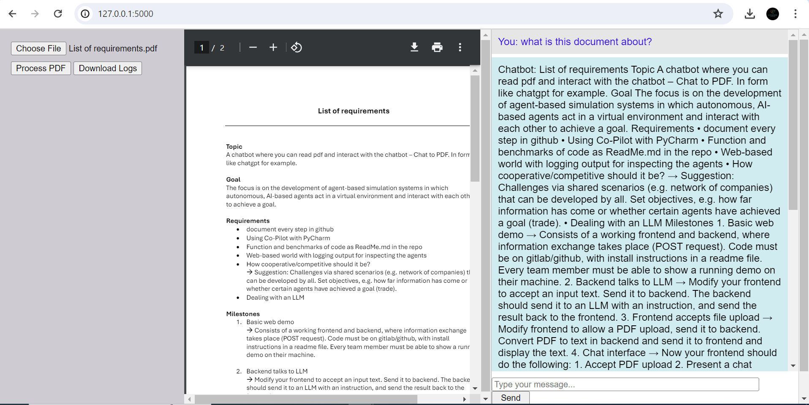

---

# Intelligent PDF & General Query Chatbot

## Project Overview
This project involves the development of an intelligent chatbot capable of answering both general questions and queries based on the content of uploaded PDFs. It was created approximately 3–4 months ago for a client. The chatbot uses **SentenceTransformer** (`paraphrase-MiniLM-L6-v2`) for understanding user queries and **Qwen-1.5-72B-Chat** for generating detailed responses. The interface allows users to upload PDFs, interact with the content, and receive chatbot responses, along with the option to download logs.




## Features
- **PDF Query Support**: The chatbot can process and understand the content of uploaded PDFs and respond accordingly.
- **General Query Support**: Handles non-PDF related questions as well.
- **Custom Interface**: Built using Java, HTML, and CSS, it displays the uploaded PDF and provides input fields for queries.
- **Log Download**: Users can download chat logs in JSON format for future reference.

## Technologies Used
- **Backend Models**:
  - [SentenceTransformer](https://www.sbert.net) (`paraphrase-MiniLM-L6-v2`)
  - [Qwen-1.5-72B-Chat](https://openai.com) (for generating responses)
  
- **Frontend**: Java, HTML, CSS
- **PDF Processing**: Integrated with the interface for direct interaction
- **Logs**: JSON format for download

## Setup and Installation

### Prerequisites
- Python 3.x
- Docker (optional, if deploying via Docker)
- Java (for the custom UI)
- HTML, CSS files (for the interface)

### Steps to Run the Application

1. **Clone the Repository**:
   ```bash
   git clone https://github.com/Um-E-Salma/Intelligent-PDF-General-Query-AI-Chatbot-with-Log-Download-Feature
   cd Intelligent-PDF-General-Query-AI-Chatbot-with-Log-Download-Feature
   ```

2. **Install Dependencies**:
   Install the required Python packages by running:
   ```bash
   pip install -r requirements.txt
   ```

3. **Run the Application**:
   To start the application, run the following command:
   ```bash
   python app.py
   ```

4. **Access the Application**:
   Open your browser and go to `http://localhost:5000`.

### Docker Setup (Optional)
1. **Build Docker Image**:
   ```bash
   docker build -t chatbot-app . 
   ```

2. **Run Docker Container**:
   ```bash
   docker run -p 5000:5000 chatbot-app
   ```

## How to Use

1. **Upload a PDF**: 
   Use the interface on the right side to select and upload your PDF.
   
2. **Ask Questions**:
   You can ask the chatbot questions based on the uploaded PDF or any general queries.

3. **Download Logs**:
   Click the **Download Logs** button to download chat logs in JSON format.

## Deployment
The app can be deployed on cloud platforms like **Heroku**, **AWS**, or others by following their specific deployment instructions.

## License
This project is licensed under the [MIT License](LICENSE).

---
